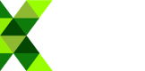

# Friends of Grin

The following companies, institutions, or individuals have generously donated financial resources to the Grin project under our [community funding model](funding.md). We're grateful for their support, and are proud to display their logos or names as supporters of Grin.

## Companies

## Individuals

Jameson Lopp - Jack Misteli Jean-Guillaume

## Anonymous Supporters

We'd also like to explicitly thank everyone who's donated to one of Grin's campaigns but chosen to remain anonymous. We're working to protect that choice!
