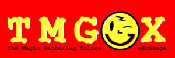
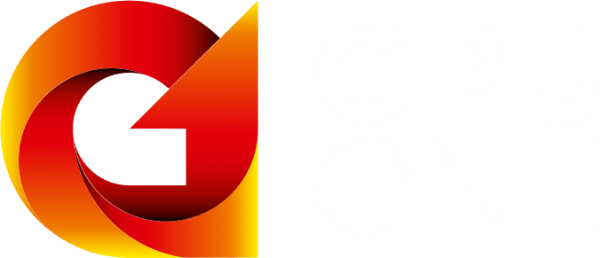
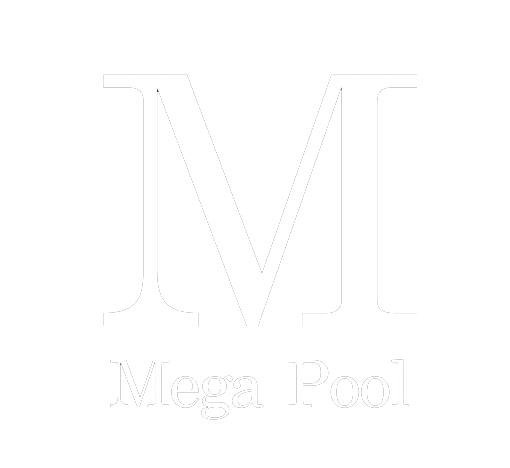
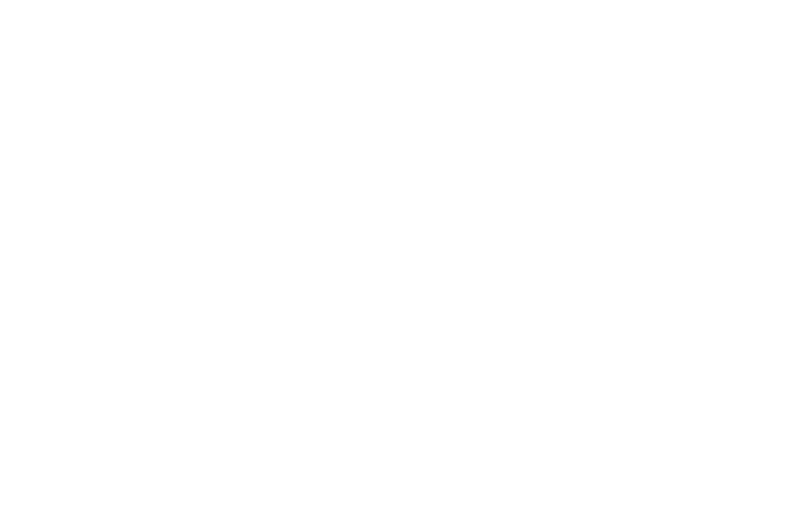

# Friends of Grin

The following companies, institutions, or individuals have generously donated financial resources to the Grin project under our [community funding model](funding). We're grateful for their support, and are proud to display their logos or names as supporters of Grin.

## Companies

<!-- Temporary black div until we convert to black on white logos -->
<section class="companies">
	
	
	
	
	
	
	
	
	
	
	
	
	
	
	
</section>

<article markdown="1" class="post-content">
## Individuals

_In alphabetical order:_
Redouan Ahaloui - Aurel - Leonid Beder - Roy Blankman - Ivan Brightly - Guy Corem - Chance Du - Michalis Kargakis - Jameson Lopp - Chris McCann - Jack Misteli Jean-Guillaume - Bart Mol - Yan Pritzker - Hendrik Richter - Niels de Ruiter - Max Tannahill - Aaron Ting - Alexander Zaidelson

## Anonymous Supporters

We'd also like to explicitly thank everyone who's donated to one of Grin's campaigns but chosen to remain anonymous. We're working to protect that choice!

## Minimum amounts

100 USD in crypto-equivalent in order to be listed in the individuals section, 1,000 USD in the companies section.
</article>
