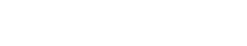
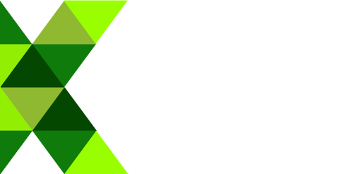
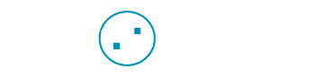
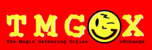

<section class="hero is-fullheight is-default is-bold">
  

    
  

  

    

      

        

          
        

        

           <h1 class="title is-2" style="margin-bottom: 2rem;">
            Meet Grin
          </h1>
          <h2 class="subtitle is-3">
            the private & friendly  mimblewimble blockchain 
          </h2>
           
          

          <a href="https://github.com/mimblewimble/grin/blob/master/doc/intro.md" class="button is-medium is-warning is-outlined">
            What's Mimblewimble?
          </a>
          <a href="https://github.com/mimblewimble/grin" class="button is-medium is-warning is-outlined">
            <i class="fab fa-github"></i>
          </a>
          

        

      

    

  

  

    <!-- CTA BOX -->
    

      

      
        Currently Live: Testnet 4
       
      
        Grin is under development. Launch planned for Jan. 15th 2019.
      
      

    

    <!-- // CTA BOX -->
  

</section>
<!-- //HERO -->

<!-- BODY -->
<section class="section">
  

    

      

        

          <!-- HEADER -->
          <section>
            <h1 class="title">
              What's Grin?
            </h1>
            <h2>
              Electronic transactions for all. Without censorship or restrictions.
            </h2>
            

            Grin empowers anyone to transact or save modern money without the fear of external control or oppression. Grin is designed for the decades to come, not just tomorrow. Grin wants be usable by everyone, regardless of borders, culture, skills or access.
            

          </section>
          <!-- //HEADER  -->

            

          <!-- DESCRIPTION DOTS -->
          <section class="columns dots">

            <!-- DOT -->
            

              <h2 class="subtitle">
                
                Private
              </h2>
              
								Grin has no amounts and no addresses. Transactions can be
								trivially aggregated. To hide where a newly created
                transaction comes from, it gets relayed privately (a
                "random walk") among peers before it is publicly announced.
              
            

            <!-- //DOT -->

            <!-- DOT -->
            

              <h2 class="subtitle">
                
                Scalable
              </h2>
              
                MimbleWimble leverages cryptography to allow most of the
								past transaction data to be removed. This guarantees Grin
								won't crumble under its own weight in the long term.
              
            

            <!-- //DOT -->

            <!-- DOT -->
            

              <h2 class="subtitle">
                
                Open
              </h2>
              
                Grin is developed openly, by developers distributed all over
								the world. It's not controlled by any company,
								foundation or individual. The coin distribution is designed
								to be as fair (but not gratis) as is known to be possible.
              
            

            <!-- //DOT -->
          </section>
          <!-- //DESCRIPTION DOTS -->

          <section>
              

                

                  

                    <h1 class="title is-1">
                      Community Initiatives
                    </h1>

                      

                        

                          

                            
TestNet 4
 

                            
Grin’s fourth testnet has been <a href="https://www.grin-forum.org/t/grin-testnet-4-launch-announcement/993">released</a>! We need your help testing: if you’re able to compile from the source, <a href="https://github.com/mimblewimble/grin/blob/master/doc/build.md">see our building guide</a>.

                          

                          

                            
MainNet, Onwards!
 

                            

                            We’re currently hard at work in building the features required for mainnet.
                              
                            Check out our <a href="https://github.com/mimblewimble/grin/milestone/4">feature list</a> and jump in.
                            

                          

                          

                            

                            <a href="sec_audit">Crowdfunding the Security Audit</a>
                            
 

                            

                            TL;DR Grin is nearing its final phases of development before the release of its cryptocurrency network (mainnet).
                            

                              
                            

                            To do so safely, the Grin codebase needs to undergo a security audit. We’re soliciting donations:
                              
                            <ul>
                              <li>bitcoin legacy <a class="address-link" href="https://live.blockcypher.com/btc/address/3ChVP627KU5w4zu2rieFPF3wGXWQgmhvrs/">3ChVP627KU5w4zu2rieFPF3wGXWQgmhvrs</a></li>
                              <li>bitcoin segwit <a class="address-link" href="https://blockchair.com/bitcoin/address/bc1qdgs8vkpzr256qjlzlfht72z3mhcrdrt6wj2rfjw39j8us24gz8uq78qj65">bc1qdgs8vkpzr256qjlzlfht72z3mhcrdrt6wj2rfjw39j8us24gz8uq78qj65</a></li>
                            </ul>
                            

                              
                            

                            <a href="sec_audit">Read how we're conducting our security audit and status of funding.</a>
                            

                          

                        

                      

                  

                

              

          </section>

          <!-- FUNDING -->
          <section>
            <h1 class="title is-1">
              Community Funding
            </h1>
            

            Grin is launched fairly, free of ICO, pre-mine or founder’s reward. We rely on donations to keep working on the project. Support the movement by purchasing some swag or making a donation.
            
 
            <a href="funding" class="button is-warning is-large donate-button">Donate Now</a>
            <a href="https://tmgox.com" class="button is-info is-outlined is-large buy-swag-button">
              Buy Swag
            </a>
          </section>  
          <!-- //FUNDING -->

          <!-- PATRONS -->
          <section class="patron">
            <h2 class="title">
              Patrons
            </h2>
            

            If you’re an individual, company or institution excited about the potential of Grin or MimbleWimble, we humbly ask if you’d consider making a financial contribution to the project’s development. We’re experimenting with a <a href="funding.html">100% community-driven funding model</a>.
            

              

            <!-- COMPANY PATRONS -->
            

              <h3 class="subtitle">
                Companies
              </h3>

              <!-- SPONSOR ROW 1 -->
              

                

                  
                

                

                  
                

                

                  
                

                

                  
                

              

              <!-- //SPONSOR ROW 1 -->

              <!-- SPONSOR ROW 2 -->
              

                

                  
                

                

                  
                

                

                  
                

              

              <!-- //SPONSOR ROW 2 -->
            

            <!-- //COMPANY PATRONS -->

            <!-- PRIVATE PATRONS -->
            

              <h3 class="subtitle has-top-space">
                Private Funding Contributors
              </h3>

              <!-- SPONSOR ROW 3 -->
              

                

                  

                  Aurel
                  

                

                

                  

                  Chris McCann
                  

                

                

                  

                  Jack Misteli
                  

                

                

                  

                  Jean-Guillaume
                  

                

                

                  

                  Jameson Lopp
                  

                

              

              <!-- //SPONSOR ROW 3 -->

              <!-- SPONSOR ROW 3 -->
              

                

                  

                  Max Tannahill
                  

                

                

                  

                  Michalis Kargakis
                  

                

                

                  

                  Redouan Ahaloui
                  

                

                

                  

                  Roy Blankman
                  

                

                

                  

                  Niels de Ruiter
                  

                

              

              <!-- //SPONSOR ROW 3 -->
            

            <!-- //PRIVATE PATRONS -->

            <!-- ANON PATRONS -->
            

              <h2 class="subtitle has-top-space">
                Anonymous Funding Contributors
              </h2>
              

              And all our great anonymous supporters! We’re not forgetting your contribution, and are working to protect that choice!
              

            

            <!-- //ANON PATRONS -->
          </section>
          <!-- //PATRONS -->

        

      

    

  

</section>
<!-- //BODY -->
