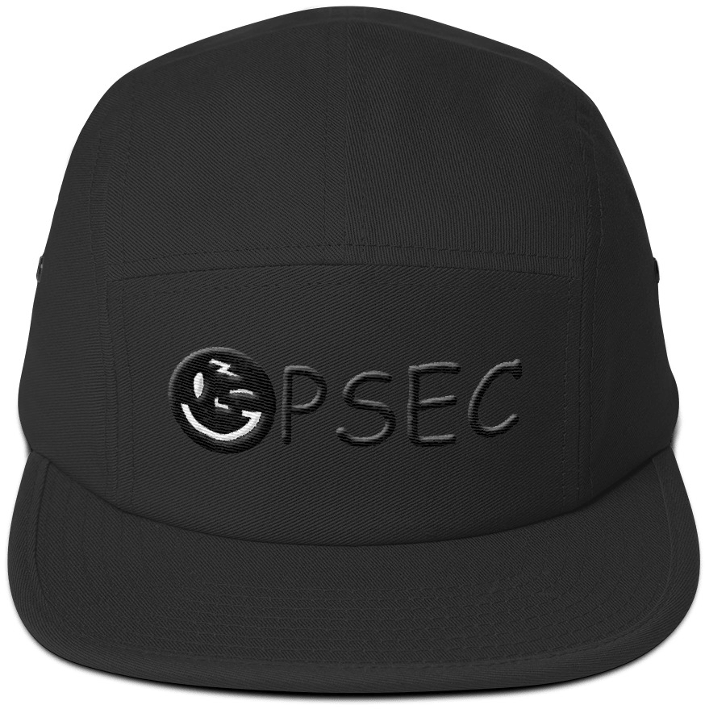

<section class="hero is-fullheight is-default is-bold">
  

    
  

  

    

      

        

          
        

        

           <h1 class="title is-2" style="margin-bottom: 2rem;">
            Meet Grin
          </h1>
          <h2 class="subtitle is-3">
            the private & lightweight  mimblewimble blockchain 
          </h2>
           
          

          <a href="https://github.com/mimblewimble/docs/wiki/Getting-Started-With-Grin%3A-Links-and-Resources" class="button is-medium is-outlined whatis">
            Getting started with Grin
          </a>
          

          

          <a href="https://github.com/mimblewimble/grin/blob/master/doc/intro.md" class="button is-medium is-outlined whatis">
            What's Mimblewimble?
          </a>
          <a href="https://github.com/mimblewimble/grin" class="button is-medium is-outlined whatis">
            <i class="fab fa-github"></i>
          </a>
          

        

      

    

  

  

    <!-- CTA BOX -->
    

      

      
        Currently Live: Floonet
       
      
        Grin is under development. Mainnet launch planned for Jan. 15th 2019.
      
      

    

    <!-- // CTA BOX -->
  

</section>
<!-- //HERO -->

<!-- BODY -->
<section class="section">
  

    

      

        

          <!-- HEADER -->
          <section>
            <h1 class="title">
              What's Grin?
            </h1>
            <h2>
              Electronic transactions for all. Without censorship or restrictions.
            </h2>
            

            Grin empowers anyone to transact or save modern money without the fear of external control or oppression. Grin is designed for the decades to come, not just tomorrow. Grin wants to be usable by everyone, regardless of borders, culture, skills or access.
            

          </section>
          <!-- //HEADER  -->

            

          <!-- DESCRIPTION DOTS -->
          <section class="columns dots">

            <!-- DOT -->
            

              <h2 class="subtitle">
                
                Private
              </h2>
              
								Grin has no amounts and no addresses. Transactions can be
								trivially aggregated. To hide where a newly created
                transaction comes from, it gets relayed privately (a
                "random walk") among peers before it is publicly announced.
              
            

            <!-- //DOT -->

            <!-- DOT -->
            

              <h2 class="subtitle">
                
                Scalable
              </h2>
              
                MimbleWimble leverages cryptography to allow most of the
								past transaction data to be removed. This guarantees Grin
								won't crumble under its own weight in the long term.
              
            

            <!-- //DOT -->

            <!-- DOT -->
            

              <h2 class="subtitle">
                
                Open
              </h2>
              
                Grin is developed openly, by developers distributed all over
								the world. It's not controlled by any company,
								foundation or individual. The coin distribution is designed
								to be as fair (but not gratis) as is known to be possible.
              
            

            <!-- //DOT -->
          </section>
          <!-- //DESCRIPTION DOTS -->

          <section>
              

                

                  

                    <h1 class="title is-1">
                      Community Initiatives
                    </h1>

                      

                        

                          

                            
MainNet, Onwards!
 

                            

                            We’re currently hard at work in stabilizing Grin for our
														mainnet release, around Jan. 15th 2019.
                              
                            Check out our <a href="https://github.com/mimblewimble/grin/milestone/4">feature list</a> and jump in.
                            

                          

                          

                            
Floonet
 

                            
Grin’s official testnet Floonet has been released! We need your help testing: either <a href="https://github.com/mimblewimble/grin/blob/master/doc/build.md">compile from the source</a> or <a href="https://github.com/mimblewimble/grin/releases/">download the grin binary</a> and join us.

                          

                        

                      

                  

                

              

          </section>

          <!-- FUNDING -->
          <section>
            <h1 class="title is-1">
              Community Funding
            </h1>
            

            Grin is launched fairly, free of ICO, pre-mine or founder’s reward. We rely on donations to keep working on the project. Support the movement by purchasing some swag or making a donation.
            
 
            <a href="funding" class="button is-warning is-large donate-button">Donate Now</a>
            <a href="https://tmgox.com" class="button is-info is-outlined is-large buy-swag-button">
              Buy Swag
            </a>
          </section>  
          <!-- //FUNDING -->

          <!-- PATRONS -->
          <section class="patron">
            <h2 class="title">
              Patrons
            </h2>
            

            If you’re an individual, company or institution excited about the potential of Grin or MimbleWimble, we humbly ask if you’d consider making a financial contribution to the project’s development. We’re experimenting with a <a href="funding.html">100% community-driven funding model</a>.
            

						  
						
We sincerely thank <a href="friends.html">all our past patrons</a> for their support.

            <!-- //ANON PATRONS -->
          </section>
          <!-- //PATRONS -->

        

      

    

  

</section>
<!-- //BODY -->
